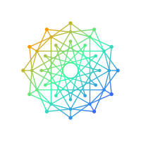

<p align="center">
  
</p>

<h1 align="center">Unisona</h1>

<p align="center"><b>A persistent, local-first AI operator console — one assistant that remembers, reasons, acts, and verifies.</b></p>

<p align="center">
  <picture>
    <source media="(prefers-color-scheme: dark)" srcset="docs/media/dream-chat-dark.png">
    
  </picture>
</p>

<p align="center">
  <a href="https://unisona.ai">unisona.ai</a> ·
  <a href="#quickstart">Quickstart</a> ·
  <a href="docs/ARCHITECTURE.md">Architecture</a> ·
  <a href="docs/KEYSTONE-PRODUCT.md">Product</a> ·
  <a href="https://www.patreon.com/c/UnisonaAI">Patreon</a>
</p>

<p align="center">
  <a href="https://github.com/alex-place/lantern-os/actions/workflows/ci.yml"></a>
  <a href="https://github.com/alex-place/lantern-os/actions/workflows/automated-tests.yml"></a>
  <a href="https://github.com/alex-place/lantern-os/actions/workflows/codeql.yml"></a>
  <a href="https://github.com/alex-place/lantern-os/actions/workflows/a11y-audit.yml"></a>
  <a href="https://github.com/alex-place/lantern-os/actions/workflows/deploy.yml"></a>
  <a href="https://github.com/alex-place/lantern-os/actions/workflows/release.yml"></a>
</p>

**Unisona** is the user-facing product; **unisona.ai** is the internal/architecture name. The repository and code paths keep the legacy `lantern-os` / `lantern-garage` names — "Lantern OS" and "Keystone" are retired brands that survive only as code identifiers (see [brand guidelines](docs/KEYSTONE-BRAND-GUIDELINES.md)).

The entire system is **one loop**:

```
Observe → Remember → Reason → Act → Verify → Converge
```

Every feature strengthens one stage of that loop. Nothing else ships.

---

## Why Unisona?

- **One assistant, real tools — not a persona zoo.** Chat is a single assistant with ~35 native tool calls (web search/fetch, document generation, GitHub, market data, memory recall, image generation, code proposals). No keyword routing, no scripted flows. See the [product definition](docs/KEYSTONE-PRODUCT.md).
- **Evidence or it didn't happen.** Every important claim carries a convergence record — `[claim, evidence, confidence, source]` — verified under the [Σ₀ (Sigma-Zero) framework](docs/CONVERGANCE-SIGMA0-BRIEFING.md), which exists to prove the system doesn't collapse into ungrounded feedback loops.
- **Local-first and private.** Your conversations, memories, and runtime state live on your machine as append-only JSONL + a [CSF archive](docs/CSF-FORMAT-SPECIFICATION.md). No telemetry. External providers are called only when you configure them. See [Privacy & security](#privacy--security).
- **Model-agnostic by design.** [10 LLM providers](PROVIDERS.md) plug in interchangeably; the live fallback chain (Gemini → Claude → OpenAI → Mistral → local Ollama) is reordered continuously by a measured [PCSF](docs/convergence-io/PCSF.md) leaderboard (`data/pcsf/provider.pcsf.json`), with capacity and privacy gates. The Convergence Core never assumes a specific LLM.
- **Measured, not vibes.** External benchmarks (HumanEval, SWE-bench, LongMemEval, …) are tracked in a maintained [benchmarks registry](docs/BENCHMARKS.md); serving is gated on leaderboard results, and the chat itself is driven through the real eval harness ([recipe](docs/CHAT-EVAL-RECIPE.md)).
- **Ships as web + native Windows app.** Use it hosted at [unisona.ai](https://unisona.ai), or install the desktop launcher (`Unisona-Setup-<version>.exe`) from [Releases](https://github.com/alex-place/lantern-os/releases).

---

## Quickstart

**Hosted (30 seconds).** Open **<https://unisona.ai>** — no local setup. (The legacy `lantern-os.net` still resolves.)

**Windows desktop.** Download `Unisona-Setup-<version>.exe` from [Releases](https://github.com/alex-place/lantern-os/releases) — a thin native launcher over one local Core ([ADR-0014](docs/adr/0014-unisona-desktop-launcher.md)).

**Local development (2 minutes).** Prerequisites: Node.js 20+, Python 3.10+.

```bash
npm install --prefix apps/lantern-garage
python -m pip install -r requirements.txt
node apps/lantern-garage/server.js
# → http://127.0.0.1:4177
```

**Full stack (dual-boot dev).**

```bash
make quickstart
# Port 4177: stable (master) · Port 4178: dev (your branch, hot-reload)
```

See **[QUICKSTART.md](QUICKSTART.md)** for autostart, configuration, and the optional services (MCP server on 8771, Discord bot, Docker stack). API keys go in `.env` / `.env.local` at the repo root (gitignored) — or set them in the UI settings drawer.

---

## What ships today (v1.10)

Capabilities, organized by the loop stage they strengthen:

| Stage | Live today |
|---|---|
| **Observe** | [Explore feed](docs/EXPLORE-FEED.md) — single PCSF-ranked content stream · market-data collectors (Kalshi, stocks) · in-app issue reporter with auto-capture |
| **Remember** | [CSF](docs/CSF-FORMAT-SPECIFICATION.md) memory archive + append-only JSONL logs · confidence-decay memory (facts fade unless reinforced) · per-user conversation storage · in-chat memory recall |
| **Reason** | unisona.ai chat — fast-cached default + deep Σ₀ opt-in (`OURO_NATIVE=1`) · personal cockpits (financial reasoning, preference model, tutor) · deterministic convergence router (120+ intent routes, >70% cache hit) over the 10-provider chain |
| **Act** | ~35 native chat tools ([`tool-runner.js`](apps/lantern-garage/lib/tool-runner.js)) · autowork draft PRs with in-chat Approve / Rework / Discard · trading terminal (60+ [REST endpoints](docs/trading-api-reference.md)) · document generation (.docx/.xlsx/.pptx) |
| **Verify** | Σ₀ verification + convergence records · fact-check button + grounding-diff viewer · drift canaries · council exec-verify · WCAG 2.1 AA on all surfaces · autonomous Playwright test fleet |
| **Converge** | Decision journal + calibration scoring · [external benchmarks registry](docs/BENCHMARKS.md) · PCSF provider leaderboard · CI convergence gates |

**Main surfaces** (all in [`apps/lantern-garage/public/`](apps/lantern-garage/public/)): `dream-chat.html` (the chat — primary UI) · `explore.html` (feed) · `kalshi-terminal.html` + `stock-trader.html` (trading) · `create.html` (creator studio) · `knowledgecenter.html` (docs RAG) · `three-doors-game.html` (Σ₀ game mode) · `orchestration.html` (operator settings).

**Current release: `1.10.0` (2026-07-14)** — see [CHANGELOG.MD](CHANGELOG.MD) and the in-app [What's New](apps/lantern-garage/public/whats-new.html). In flight: the v1.11 polish pass ([open issues](https://github.com/alex-place/lantern-os/issues)). Historical milestone writeup: [Unisona 1.8 — "one front door"](docs/UNISONA-1.8.md).

---

## Architecture

```
Browser UI (public/*.html, PWA)
        │
        ▼
apps/lantern-garage/server.js ── routes/*  (plain handlers, no framework)
        │                         lib/*     (chat, tool-runner, memory, PCSF routing)
        ├── SSE stream  /api/dream/stream
        ├── data/*.json(l)  append-only runtime state
        ▼
LLM providers: Gemini · Claude · OpenAI · Mistral · … · Ollama (local)   ← PCSF-ordered
Python services: MCP server (:8771) · convergence engine · Discord bot
```

| Service | Language | Port | Purpose |
|---------|----------|------|---------|
| Lantern Garage | Node.js | 4177 | Main web server + API (single entrypoint) |
| MCP Server | Python | 8771 | Local agent tool surface + OAuth2 |
| Convergence Engine | Python | — | Loop orchestration + health |
| Discord Bot | Python | — | Chat bridge + convergence |
| Auto-Deploy | Windows task | — | 5-min master pulls (`merge --ff-only`) + health-checked rollback |

Autonomous subsystems that run without operator intervention:

| System | Where | What it does |
|--------|-------|--------------|
| Health gate | [`lib/health-aggregator.js`](apps/lantern-garage/lib/health-aggregator.js) | One boot health-check + readiness verdict — enumerates every moving part (web server, Ollama, MCP, trader, cloud providers) as up / down / disabled-with-reason |
| Auto-deploy | scheduled task `KeystoneAutoDeployStable` | Non-destructive `git merge --ff-only` every 5 min; health check + automatic rollback |
| Convergence router | [`lib/convergence-router.js`](apps/lantern-garage/lib/convergence-router.js) | Deterministic intent cache — same input, same route; providers only on cache miss |
| PR watcher | [`lib/pr-watcher.js`](apps/lantern-garage/lib/pr-watcher.js) | Auto-merges green, conflict-free, fleet-approved PRs; protected paths (auth/money/workflows/secrets/migrations) always need a human |

Full subsystem map: **[docs/ARCHITECTURE.md](docs/ARCHITECTURE.md)** · design rationale: **[ADR index](docs/adr/README.md)**.

---

## Verification & trust (Σ₀)

unisona.ai is built on **Σ₀ (Sigma-Zero)** — a framework for verifying that feedback-driven systems stay grounded instead of collapsing into degenerate fixed points. In practice:

- **External Reality Rule** — nothing is accepted without evidence; every important claim ships as `[claim, evidence, confidence, source]`.
- The five Σ₀ routing/feedback paradoxes identified in 2026-06 (agent-selection hard loop, unbounded provider retries, stale route cache, silent memory truncation, ignored escalation gates) are all fixed with measurement loops and feedback gates, verified under stress testing.
- Verification surfaces are user-facing: fact-check button, grounding-diff viewer, drift canaries, and confidence-scored convergence records.

Deep dive: **[Σ₀ briefing](docs/CONVERGANCE-SIGMA0-BRIEFING.md)** · **[anti-collapse hardening](docs/ANTI-COLLAPSE-HARDENING.md)** · **[research canon](docs/RESEARCH-CANON.md)**.

## Privacy & security

- **Local-first by design** — dream journal data, conversations, and runtime receipts stay on your machine; private folders (`data/private/`, `data/wallet/`) are never synced.
- **No telemetry or tracking built in.**
- **Providers are opt-in** — external APIs are called only when you configure keys (`.env.local`, gitignored, or the UI settings drawer).
- **Accounts & auth** — email + password (scrypt) with an email-confirmation hard gate, plus Google, Discord, and Patreon OAuth ([setup guide](docs/PATREON-OAUTH.md)); Patreon tiers map to roles.
- Vulnerability guidelines and hardening notes: **[SECURITY.md](SECURITY.md)**.

---

## Development

**Required reading before contributing** (enforced by repo-managed git hooks): [CLAUDE.md](CLAUDE.md) · [AGENTS.md](AGENTS.md) · [SECURITY.md](SECURITY.md) · [QUICKSTART.md](QUICKSTART.md) · [CONTRIBUTING.md](CONTRIBUTING.md).

```bash
# Node API/chat tests (server must be running)
npm run test:api --prefix apps/lantern-garage
npm run test:chat --prefix apps/lantern-garage
npm run test:ui  --prefix apps/lantern-garage   # requires Playwright

# Python tests (full suite runs clean, no --ignore flags)
python -m pytest tests/ -q --tb=short

# Syntax check server entrypoints
make check-node

# Auth E2E (from repo root)
npm run test:auth
```

**Workflow in one paragraph.** Branch from `master` in your lane (`claude/`, `gemini/`, `codex/`, … for agents; any `<name>/` prefix becomes a dynamic human lane; there is **no open-PR cap per lane**). Make one logical change. If it touches code, add a changelog fragment — `node scripts/new-changelog.mjs "what changed and why" --kind added|fixed|changed` — the pre-push gate requires it (docs-only changes are exempt; fragments fold into [CHANGELOG.MD](CHANGELOG.MD) at release). Push, open a PR, and the PR watcher auto-merges it once CI is green and the fleet auto-review returns `VERDICT: APPROVE` — protected paths (auth, money, `.github/workflows/`, secrets, migrations) always wait for a human. Full lane table and merge rules: [AGENTS.md](AGENTS.md).

**Golden rules:** small reviewable PRs · test locally before pushing · never commit secrets · don't skip hooks or safety checks unless explicitly authorized.

---

## Documentation map

| Audience | Start here |
|----------|-----------|
| **Agents / contributors** | [CLAUDE.md](CLAUDE.md) · [AGENTS.md](AGENTS.md) · [CONTRIBUTING.md](CONTRIBUTING.md) · [QUICKSTART.md](QUICKSTART.md) |
| **Members / product** | [unisona.ai chat product definition](docs/KEYSTONE-PRODUCT.md) · [Dream Journal quickstart](docs/DREAM-JOURNAL-QUICKSTART.md) · [Explore feed](docs/EXPLORE-FEED.md) |
| **Architects** | [Σ₀ briefing](docs/CONVERGANCE-SIGMA0-BRIEFING.md) (start here) · [ARCHITECTURE.md](docs/ARCHITECTURE.md) · [ADR index](docs/adr/README.md) · [CSF format spec](docs/CSF-FORMAT-SPECIFICATION.md) · [PCSF](docs/convergence-io/PCSF.md) · [convergence-core mapping](docs/convergence-core-mapping.md) |
| **Traders / analysts** | [Trading API reference](docs/trading-api-reference.md) · [Kalshi API spec](docs/KALSHI-API-SPEC.md) · [experiments/](experiments/) |
| **Operators / deploy** | [PROVIDERS.md](PROVIDERS.md) · [Cloudflare tunnel deployment](docs/CLOUDFLARE-TUNNEL-DEPLOYMENT.md) · [repo contract](docs/REPO-CONTRACT.md) · [CHANGELOG.MD](CHANGELOG.MD) |

Something broken? Search or file a [GitHub issue](https://github.com/alex-place/lantern-os/issues) (labels: `bug`, `p0`, `p1`, `convergence`).

---

## License

**Proprietary** — © 2026 Alex Place, all rights reserved (see [LICENSE](LICENSE)). Members get access to the product and tools via [unisona.ai](https://unisona.ai) and [Patreon](https://www.patreon.com/c/UnisonaAI).

Built with Node.js · Python · Claude / Gemini / OpenAI / Mistral / Ollama (multi-provider routing) · CSF/CADD (custom memory architecture).

## Quick links

- **Live product:** <https://unisona.ai> (legacy: <https://lantern-os.net>)
- **Releases (desktop app):** <https://github.com/alex-place/lantern-os/releases>
- **MCP server:** <https://mcp.lantern-os.net>
- **Issues:** <https://github.com/alex-place/lantern-os/issues>
- **Community:** <https://www.patreon.com/c/UnisonaAI>
