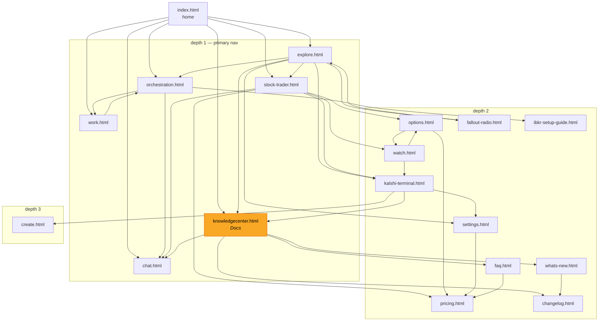
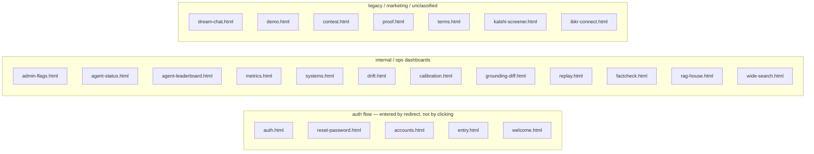

# Sitemap & Navigation Map

How a user actually moves through unisona.ai, measured from the shipped HTML rather than from intent.

Generated by `npm run navmap` (`scripts/build-nav-map.mjs`) into `tests/e2e-sitemap/nav-map.json`, and enforced by `npm run test:sitemap`. Regenerate after any nav change.

**Measured 2026-07-31:** 42 pages · 18 reachable from `/` by clicking · 24 orphaned · 14 in `sitemap.xml`.

> **Nav is partly runtime-injected.** `js/site-chrome.js` builds the top nav and footer from its `NAV_LINKS` array, so those links never appear in a page's static markup. `build-nav-map.mjs` reads `NAV_LINKS` and attributes it to every page that loads the script — without that, the map would badly understate reachability.

---

## The click graph

Depth is literal click count from the home page for a signed-in user.



Knowledge Center (highlighted) sits at depth 1 as **Docs** in the shared nav. Before [#3107](https://github.com/alex-place/lantern-os/issues/3107) it had exactly one real inbound nav edge — the `quick-links` footer of `explore.html` — which left it at depth 2, and one deleted link away from being fully orphaned. Promoting it also pulled `faq`, `changelog`, and `whats-new` up from depth 3 to 2, since they hang off the Knowledge Center.

The spec pins this with `maxKnowledgeCenterDepth: 1`, so the entry cannot silently slip back behind another page.

## Orphans — 24 pages with no click path from home



The grouping above is a **proposed** triage, not a verified one — #3109 is where each page gets its real classification.

## Sitemap disagreements

Two directions, and they are not equally bad.

**In `sitemap.xml` but unreachable by clicking (3)** — crawlers are told these exist; users cannot navigate to them:

| Page | Note |
|---|---|
| `proof.html` | links out to pricing, nothing links in |
| `terms.html` | reachable only from `auth.html`, itself orphaned |
| `welcome.html` | post-signup landing; entered by redirect |

**Reachable but absent from `sitemap.xml` (7)** — real, clickable surfaces invisible to search:

`orchestration.html` · `work.html` · `settings.html` · `options.html` · `watch.html` · `fallout-radio.html` · `ibkr-setup-guide.html`

Note that `orchestration.html` and `work.html` are **depth-1 primary nav entries** that no crawler is told about.

## What the test covers

`tests/e2e-sitemap/sitemap-nav.spec.js` — 7 checks, all navigation performed by real clicks:

| Check | Asserts |
|---|---|
| home renders primary nav | every depth-1 target is linked from `/` |
| depth-1 reachable by clicking | each nav link lands on its page |
| KC reachable by clicking | walks the current shortest path, and pins depth ≤ 1 |
| KC renders catalog | the page actually populates, not just responds |
| sitemap URLs serve | every `<loc>` returns < 400 |
| sitemap not stranded | in-sitemap-but-unreachable stays ≤ 3 |
| orphan count not regressed | orphans ≤ 24, reachable ≥ 18 |

The last two are a **ratchet**: they permit improvement and fail on regression. Tighten the `BASELINE` constants in the spec whenever a fix lands.

### Signed-in by default

The config sends `X-Test-Auth` + `X-Test-Role: deep_dreamer`. Without it every nav click bounces to `auth.html` and the spec would only ever measure the login wall — navigability is a question about a user who is already in. A bare token authenticates at *guest* privilege, which is still gated ([#2645](https://github.com/alex-place/lantern-os/issues/2645)), so the role must be named explicitly.

## Running it

```bash
npm run test:sitemap
```

Watchable playback in a real browser window (`slowMo: 450`):

```bash
npm run test:sitemap:headed
```

Regenerate the map only:

```bash
npm run navmap
```

### First run in a fresh worktree

A worktree has no `node_modules`. Install without triggering the Rust build in `postinstall`:

```bash
npm install --no-save --ignore-scripts @playwright/test@1.62.1
```

```bash
npm install --prefix apps/lantern-garage --ignore-scripts
```

```bash
npx playwright install chromium
```
